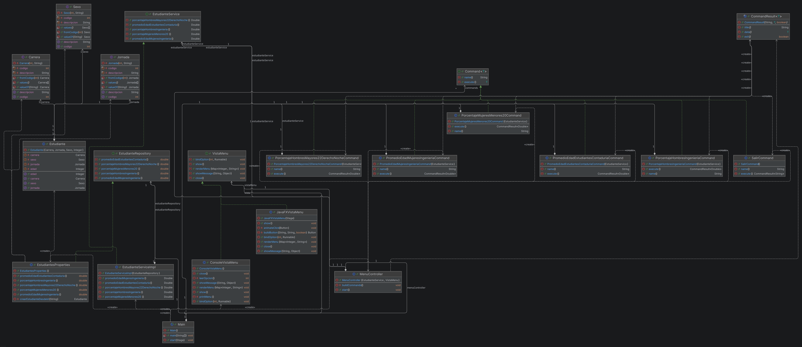
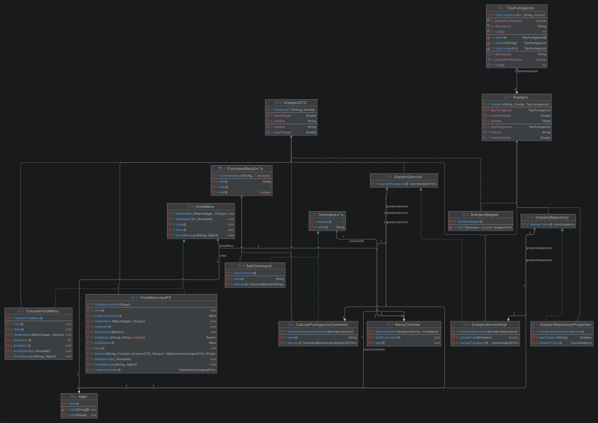
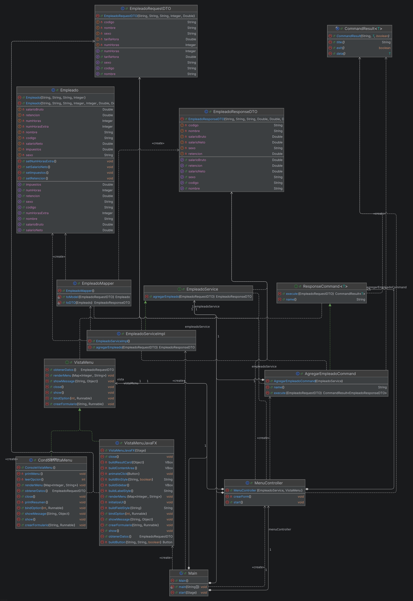
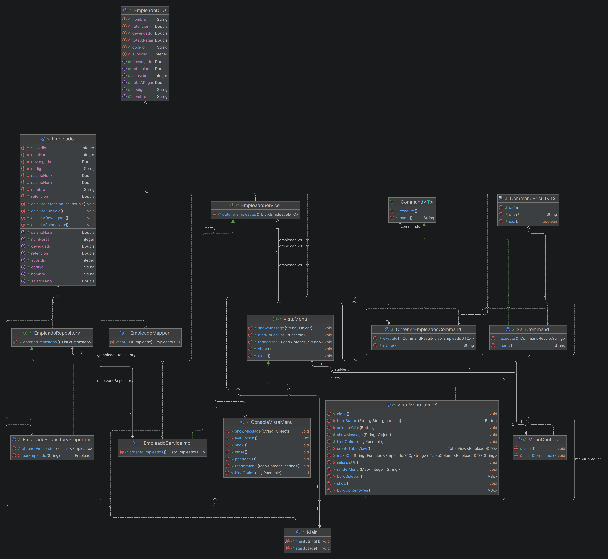
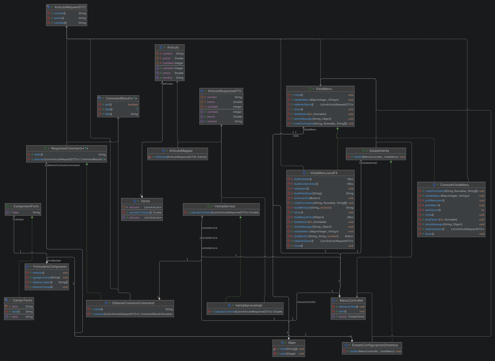
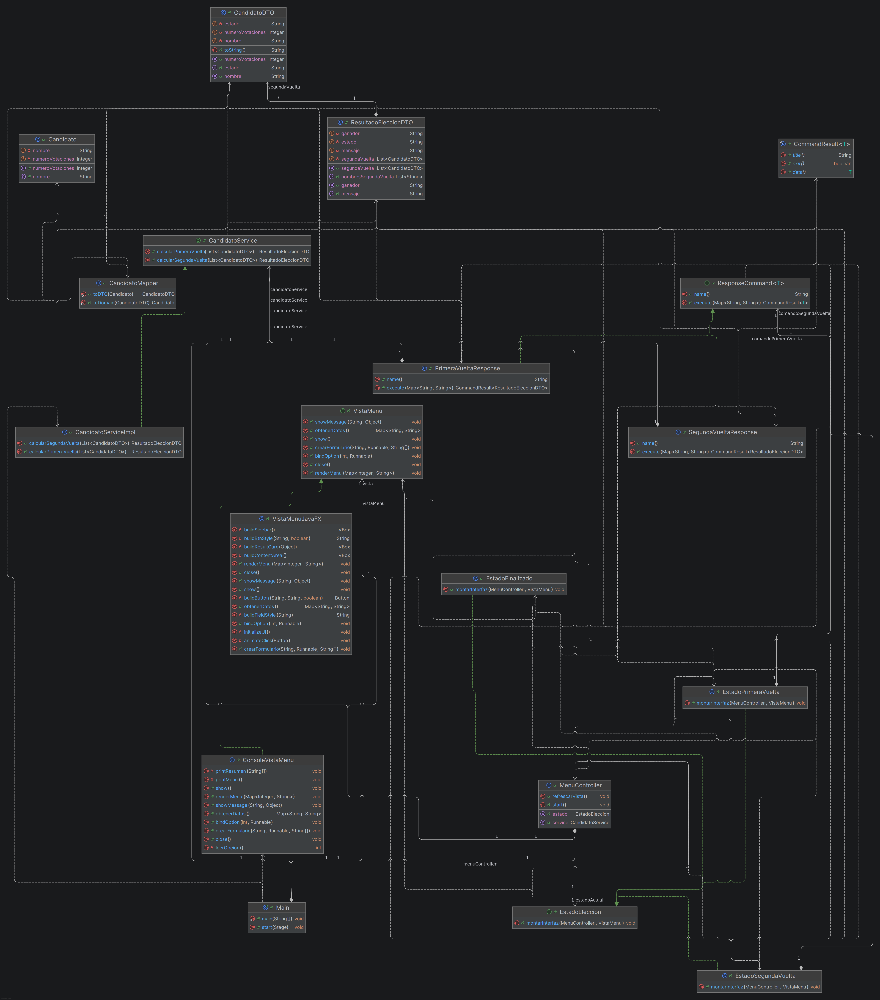
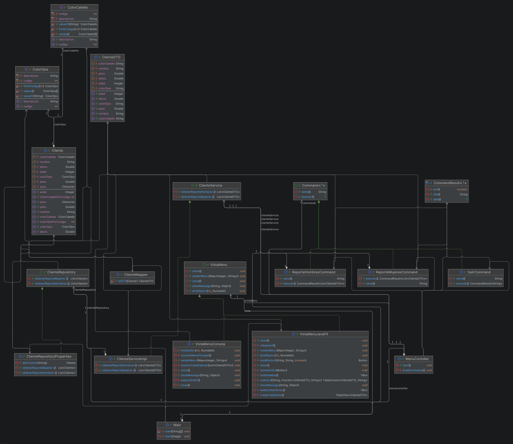

# DOCUMENTACIÓN DE SISTEMAS

## Arquitectura General
Todos los proyectos siguen el patrón arquitectónico **MVC (Modelo-Vista-Controlador)**, separando claramente la lógica de negocio, la interfaz de usuario y el control de flujo.

## Principios de Diseño
En todos los ejercicios se aplican consistentemente los siguientes principios:
*   **Inversión de Dependencias (DIP):** Se utilizan interfaces para definir contratos (ej. `EstudianteService`, `Command`, `State`), permitiendo que los módulos de alto nivel no dependan de implementaciones concretas.
*   **Composición:** Las clases complejas se construyen combinando objetos más simples (ej. `MenuController` tiene una referencia a `Service` o `Vista`).
*   **Inyección de Dependencias (DI):** Las dependencias (como servicios o vistas) se inyectan en los controladores (generalmente por constructor), facilitando el testeo y el desacoplamiento.

## Patrones Específicos
A continuación se detalla el análisis técnico de cada proyecto, identificando el patrón de diseño específico revelado por su estructura interna.

---

### Ejercicio 1: Información Estudiantes
**Patrón Específico:** Command

#### Análisis
*   **Entrada (Modelo):** Datos de `Estudiante` (Edad, Sexo, Carrera, Jornada).
*   **Salida (Vista):** Estadísticas calculadas (Promedios, porcentajes por carrera/género).

#### Diseño
#### Diseño
*   **MVC:** El `MenuController` gestiona la interacción. La `VistaMenu` captura opciones. El modelo `Estudiante` define la estructura de datos.
*   **Patrón Command:** Se implementa mediante la interfaz `Command<T>` y clases concretas como `PorcentajeHombresIngenieriaCommand`, encapsulando cada solicitud de cálculo como un objeto.
*   **DI y Composición:** El controlador recibe instancias de los comandos y del servicio `EstudianteService`, delegando en ellos la lógica y permitiendo extender nuevas operaciones sin modificar el controlador.

---

### Ejercicio 2: Fumigación
**Patrón Específico:** Command

#### Análisis
*   **Entrada (Modelo):** Solicitudes de fumigación (`Granjero`, Tipo de fumigación, Hectáreas).
*   **Salida (Vista):** Valor a pagar por cada granjero, aplicando descuentos.

#### Diseño
#### Diseño
*   **MVC:** `MenuController` coordina. `VistaMenu` muestra resultados. Modelo `Granjero` y `TipoFumigacion`.
*   **Patrón Command:** Clases como `CalcularFumigacionCommand` implementan la interfaz `Command<T>` para encapsular la lógica de negocio de cada tipo de cálculo.
*   **DI y Composición:** El `MenuController` compone una lista de comandos y un `GranjeroService`. El servicio se inyecta, desacoplando el acceso a datos del control de flujo.

---

### Ejercicio 3: Nómina Molina Corp
**Patrón Específico:** Command (Variante Response/Request)

#### Análisis
*   **Entrada (Modelo):** Datos de `Empleado` (Horas trabajadas, salario base, etc.).
*   **Salida (Vista):** Desprendible de nómina (Salario bruto, retenciones, neto).

#### Diseño
#### Diseño
*   **MVC:** `MenuController` maneja la lógica de presentación.
*   **Patrón Command:** Uso de interfaces como `ResponseCommand<T>` para manejar las peticiones y respuestas de manera estructurada, devolviendo un `CommandResult<T>`.
*   **DI y Composición:** `EmpleadoService` es inyectado en el controlador. La composición permite que el controlador maneje múltiples comandos sin conocer su implementación interna.

---

### Ejercicio 4: Nómina Variable
**Patrón Específico:** Command

#### Análisis
*   **Entrada (Modelo):** Información de empleados con número de hijos y salario por hora.
*   **Salida (Vista):** Cálculo detallado de devengado, subsidio y total.

#### Diseño
#### Diseño
*   **MVC:** Estructura clásica con `Empleado` como modelo y `VistaMenu` como interfaz.
*   **Patrón Command:** `ObtenerEmpleadosCommand` implementa la interfaz `Command` para abstraer la operación de recuperación y cálculo.
*   **DI y Composición:** Inyección de `EmpleadoRepository` o `Service` en los comandos y el controlador, asegurando que la lógica de persistencia/negocio esté separada.

---

### Ejercicio 5: Comisiones Ventas
**Patrón Específico:** State y Composite

#### Análisis
*   **Entrada (Modelo):** `Articulo` (Precio), `Venta`.
*   **Salida (Vista):** Comisión total calculada según reglas de precio.

#### Diseño
#### Diseño
*   **MVC:** Controlador gestiona las ventas.
*   **Patrón State:** La interfaz `EstadoVenta` define el contrato para los estados (ej. `EstadoConfiguracionDinamica`), permitiendo comportamiento variable según el estado del sistema.
*   **Patrón Composite:** La interfaz `ComponentForm` permite tratar a objetos individuales y composiciones de manera uniforme (estructura de árbol).
*   **DI y Composición:** El controlador mantiene referencias a `EstadoVenta`, delegando el comportamiento actual.

---

### Ejercicio 6: Elecciones Presidenciales
**Patrón Específico:** State

#### Análisis
*   **Entrada (Modelo):** Votos por candidato (`Juan`, `Pedro`, `Maria`).
*   **Salida (Vista):** Ganador en primera vuelta o paso a segunda vuelta.

#### Diseño
#### Diseño
*   **MVC:** El controlador cambia su comportamiento según la etapa de la elección.
*   **Patrón State:** La interfaz `EstadoEleccion` es implementada por `EstadoPrimeraVuelta`, `EstadoSegundaVuelta`, etc., para gestionar la transición y reglas de negocio.
*   **DI y Composición:** El controlador mantiene una referencia a `EstadoEleccion` (Composición) y cambia dinámicamente la implementación concreta (Transición de estado).

---

### Ejercicio 8: Estadísticas Clientes (Peso/Altura)
**Patrón Específico:** Command

#### Análisis
*   **Entrada (Modelo):** `Cliente` (Peso, altura, sexo, color ojos/cabello).
*   **Salida (Vista):** Listados filtrados por criterios complejos (ej. mujeres rubias de cierta altura).

#### Diseño
#### Diseño
*   **MVC:** Controlador filtra y presenta datos.
*   **Patrón Command:** `ReporteHombresCommand` y `ReporteMujeresCommand` implementan la interfaz `Command<T>` para encapsular consultas y filtros complejos.
*   **DI y Composición:** Los comandos reciben el repositorio o servicio de clientes via inyección, permitiendo reutilizar la lógica de filtrado.

---

### Ejercicio 9: Función Exponencial
**Patrón Específico:** Strategy (Inferencia basada en estructura)

#### Análisis
*   **Entrada (Modelo):** Parámetros para la función exponencial.
*   **Salida (Vista):** Resultado del cálculo matemático.

#### Diseño
#### Diseño
*   **MVC:** Implementado en Python con `Controlador`, `VistaMenu` y `Exponencial` (Modelo/Operación).
*   **Patrón Strategy:** El `Controlador` recibe un objeto `operacion` (ej. `Exponencial`) que cumple con el contrato implícito (Duck Typing) de tener un método `execute` o similar. Permite intercambiar algoritmos.
*   **DI y Composición:** La inyección de dependencias es explícita en el constructor: `c = Controlador(VistaMenu(),Exponencial())`. El controlador está compuesto por una vista y una operación.

---

### Nota sobre Ejercicio 7
La carpeta correspondiente al Ejercicio 7 (Accidentes de tránsito) no se encuentra en la estructura de directorios proporcionada, por lo que no se ha incluido en este análisis.
